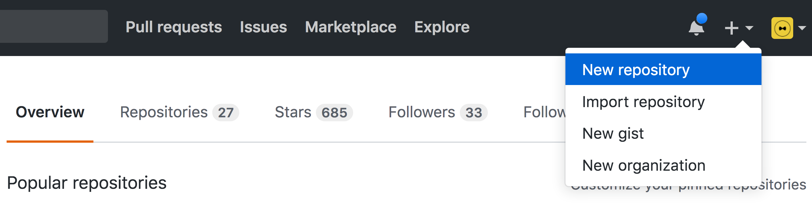

The following tutorial demonstrates how can you host your static website on github. It assumes that you have an account on **[github](https://github.com)**. If you don't, go ahead and create one!

Also, the git client has to be installed on the system. If it is not, [download](http://git-scm/downloads/) the git client for your particular system and install it.

> To make it easier for everybody, we'll use as an example this exact page.


## [](#step-1)Step 1

We'll start of by creating a new empty repository. Head over to [Gihub](https://github.com) and create a new repository.



> Insert `github-pages-demo` in the **repository name** field and click on **Create repository**


## [](#step-2)Step 2

Click on **Download .zip** on the top of this page to download this website. When the download has finished, unzip that folder!


## [](#step-3)Step 3

Open a terminal in the current window and change the directory to `github-pages-demo`.

```
cd github-pages-demo
```


## [](#step-4)Step 4

Initialize a new git repository

```
$ git init
```


## [](#step-5)Step 5

Add files to the staging area and check the status of the repository.

```
$ git add --all
$ git status
```


## [](#step-6)Step 6

Make the first commit

```
$ git commit -m "initial commit"
```


## [](#step-7)Step 7

Now we need to link the local repository with the empty one from github. Write the following in your terminal

```
git remote add origin https://github.com/{username}/gihub-pages-demo.git
```


## [](#step-8)Step 8

Push local changes to the remote repository on **Github**

```
git push origin master
```

We are almost done! We have now pushed out website on github. We need to tell github that this is a website that we want them to host for us!

In order to do that, we'll create a new branch with a special name `gh-pages`

## [](#step-9)Step 9

```
git checkout -b gh-pages
```

Now we need to send the new branch to the remote repository

```
git push origin
```

This will fail. Follow the instructions given by git and try again!

```
git push --set-upstream origin gh-pages
```


## [](#step-10)Step 10

Wait few minutes (depends on how busy the servers are) and go to `https://{username}.github.io/ghithub-pages-demo/`

Congratulations! Your website should now be hosted on github.
